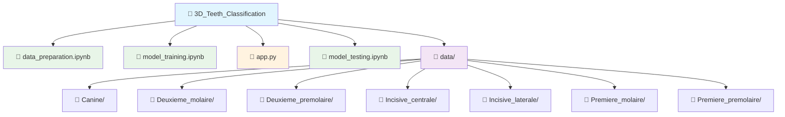

# Classification des Dents en 3D avec ConvNet

## Introduction

Ce projet, réalisé par Abdelilah Ourti utilise des réseaux de neurones convolutifs (ConvNet) pour classifier des modèles de dents en 3D. Il combine l'expertise industrielle en imagerie 3D avec des techniques avancées d'apprentissage profond pour améliorer la précision et l'efficacité des diagnostics dentaires.

## ✨ Fonctionnalités

- **Classification de dents 3D** : Chargez un fichier .obj de dent 3D, et l'application le classifie parmi les catégories suivantes :
  - Canine
  - Deuxième molaire
  - Deuxième prémolaire
  - Incisive centrale
  - Incisive latérale
  - Première molaire
  - Première prémolaire

- **Visualisation 3D** : Permet d'explorer le modèle 3D en temps réel, avec des vues à 360 degrés
- **Prédictions en temps réel** : L'application offre une classification instantanée dès que le modèle 3D est téléchargé
- **Prise en charge de plusieurs formats** : Support des fichiers `.obj`, `.stl` et `.ply`
- **Téléchargement des résultats** : Export des résultats au format JSON avec probabilités
- **Comparaison de modèles** : Comparaison visuelle simultanée de plusieurs modèles de dents
- **Historique des téléchargements** : Suivi des modèles précédemment classifiés
- **Performances optimisées** : Gestion efficace des fichiers 3D volumineux

## 🔧 Prérequis

Assurez-vous d'avoir installé les prérequis suivants avant d'exécuter le projet :

- Python 3.7 ou plus récent
- TensorFlow
- Streamlit
- Trimesh
- PyVista

### Installation des dépendances

```bash
pip install tensorflow streamlit trimesh pyvista scipy
```

## 📦 Installation

1. Clonez ce dépôt sur votre machine locale :
```bash
git clone https://github.com/votre-utilisateur/3D-Teeth-Classification.git
cd 3D-Teeth-Classification
```

2. Installez les dépendances mentionnées dans la section "Prérequis"

3. Placez le modèle pré-entraîné `teeth_classification_model.h5` dans le répertoire racine du projet

## 🚀 Utilisation

Pour exécuter l'application Streamlit, utilisez la commande suivante :

```bash
streamlit run app.py
```

Cela lancera l'application web dans votre navigateur par défaut.

## 📋 Fonctionnement

1. **Téléchargement du fichier 3D** : Téléchargez un fichier `.obj`, `.stl` ou `.ply` de dent en utilisant l'interface de téléchargement
2. **Classification** : L'application classifie la dent et affiche les probabilités pour chaque catégorie
3. **Visualisation 3D** : Visualisez le modèle 3D de la dent et explorez la vue à 360 degrés
4. **Téléchargement des résultats** : Téléchargez les résultats sous format JSON après la classification
5. **Comparaison de modèles** : Ajoutez plusieurs fichiers 3D pour une comparaison simultanée

## 📁 Structure du Projet



## ⚠️ Remarques

- **Modèle** : Le modèle de classification a été entraîné sur un jeu de données 3D spécifique. Pour obtenir des résultats optimaux, assurez-vous que les fichiers téléchargés respectent les mêmes standards de prétraitement
- **Limitations** : Le fichier téléchargé doit être un fichier `.obj`, `.stl`, ou `.ply` valide et de taille inférieure à 200MB pour garantir un traitement efficace
- **Performances** : L'application est optimisée pour gérer les modèles 3D volumineux sans compromettre les performances. Toutefois, la vitesse de traitement dépend de la taille du modèle et des ressources système

## 🤝 Contribution

Les contributions à ce projet sont les bienvenues. N'hésitez pas à ouvrir une **issue** ou à soumettre une **pull request**.

## 📧 Contact

Pour toute question ou suggestion, veuillez contacter :

**Ourti Abdelilah** - [abdelilahourti@gmail.com](mailto:abdelilahourti@gmail.com)

---

*Développé par Abdelilah Ourti*